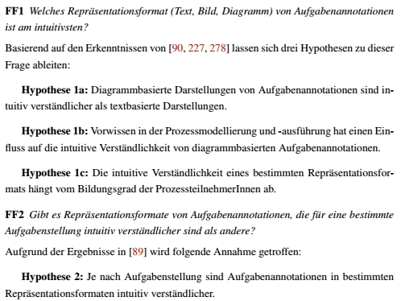

```{r setup, include=FALSE}

suppressPackageStartupMessages(if(!require(pacman)) {install.packages("pacman")})
pacman::p_load(dplyr, tidyr, ggplot2, lme4, lmerTest, emmeans, performance, sjPlot, effectsize, MuMIn, cowplot, DT, magrittr, pbkrtest)
knitr::opts_chunk$set(echo = TRUE, warning = F, fig.width = 10)
```

# Datenimport

Die Rohdaten wurden manuell in ihren Namen angepasst und die Umlaute entfernt.

```{r}
df <- read.csv2("Datensatz_Longformat.csv")
names(df)
```

# Datenbearbeitung

Es wurden nur die numerischen Variablen "Abschluss" und "Expertise" faktorisiert, damit R diese auch als kategoriale Variable in den Analysen erkennt. Für die Expertise waren die Stufen bekannt, für Abschluss nicht, daher erhält der Faktor Abschluss keine spezifischen Bezeichnungen mehr für die Stufen, während Experte (0 = ohne Vorwissen und 1 = mit Voriwssen) wurde.

```{r}
df$Abschluss <- as.factor(df$Abschluss)
df$Erfahrung <- factor(df$Erfahrung, 
                     levels = c(0, 1),
                     labels = c("ohne Vorwissen",
                                "Mit Vorwissen"))
```

# Methode / Vorgehen

Für alle Modelle aus den Fragestellungen 1 und 2 wurden *linear gemischte Modelle* (Linear-Mixed-Models, LMM) berechnet. Dazu wurde das R-Paket lme4 genutzt. Die Freiheitsgrade für die Signifikanztestung wurden mittels der Satterthwaite Methode, implementiert im R Paket lmerTest bestimmt. 
Da es sich hierbei um Messwiederholungen handelt, wurde auf Gruppenebene (Level 2) die Personen-ID (FBNUMMER) als Clustervariable genutzt. Auf Level 1 liegen die jeweiligen Werte der abhängigen Variable. Als Prädiktor für alle Modelle wird die *Repräsentation* (Faktor mit 3 Stufen) genutzt. Weitere Prädiktoren sind die *Erfahrung* (Faktor mit 2 Stufen), der *Abschluss* (Faktor mit 5 Stufen) sowie der *Aufgabenstellung* (Faktor mit 3 Stufen). Es werden für alle Prädiktoren nur feste Effekte (fixed Effects) bestimmt. Als Maß der Modellgüte wird das marginale R² (umfasst nur den Anteil erklärter Varianz der festen Effekte) nach Nakagawa, Johnson & Schielzeth (Nakagawa et al., 2017) über das Paket MuMIn bestimmt.

Da es sich bei den Prädiktoren um mehrstufige kategoriale Prädiktoren handelte, wurde im Nachgang immer noch ein *paarweiser Vergleich* durchgeführt. Diese paarweisen Vergleiche wurden mittels des Pakets emmeans bestimmt, in dem die Tukey-Methode zur Korrektur für multiples Testen angewendet wird. Zusätzlich fand eine *Visualisierung* der paarweisen Vergleiche auf Basis der in den Modell bestimmten Gruppenmittelwerte statt. In der visualisierung werden jeweils die Gruppenmittelwerte mit ihrem zugehörigen 95%-Konfidenzintervall präsentiert.


# Fragestellungen




# Modellbezeichnungen:

* Basismodell: Dies ist nur das Analysemodell in dem nur die abhängige Variable und die Repäsentation als Prädiktor vorhanden sind.
* Haupteffektmodell: Bezeichnet ein Modell, in dem die abhängige Variable, die Repräsentation sowie ein weiterer relevanter Prädiktoren drin sind. Dabei hat der weitere Prädiktor keinerlei Interaktionen mit einer anderen Variable im Modell. Sollte eine 3-frach-Interkation vorliegen, bezeichnet Haupteffektmodell das Modell in dem es keine 3-fach-Interaktionen gibt und der 3. Faktor (z.B. Erfahrung) keine Interaktionen aufweist.
* Gesamtmodell: Bezeichnet das vollständige, saturierte Modell. In diesem Modell dürfen alle Prädiktoren miteinander interagieren. Für die Fragestellungen 1b, 1c und 2 umfasst dies Modelle mit je 2-fach-Interaktion.

# Auswertungen 1 & 2

Die Auswertungen für die Fragestellungen 1 und 2 sind nach der jeweiligen abhängigen Variablen (Zufriedenheit, Effektivität, Mentale Anstrengung) gegliedert. Für jede abhängige Variable finden sich die Ergebnisse zu den einzelnen Fragestellungen in den einzelnen Reitern (Tabs).

## Zufriedenheit {.tabset}

### Modellspezifikationen

```{r}
# Basismodell (Frage 1a)
quesi_1a <- lmer(Zufriedenheit ~ Repraesentation + (1 | FBNUMMER), data = df)
# mit Experten (Fragestellung 1b)
.quesi_1b <- lmer(Zufriedenheit ~ Repraesentation + Erfahrung + (1 | FBNUMMER), data = df)
quesi_1b <- lmer(Zufriedenheit ~ Repraesentation * Erfahrung + (1 | FBNUMMER), data = df)
# mit Abschluss (Fragestellung 1c)
.quesi_1c <- lmer(Zufriedenheit ~ Repraesentation + Abschluss + (1 | FBNUMMER), data = df)
quesi_1c <- lmer(Zufriedenheit ~ Repraesentation * Abschluss + (1 | FBNUMMER), data = df)
# mit Aufgabenstellung (Fragestellung 2)
.quesi_2 <- lmer(Zufriedenheit ~ Repraesentation + Aufgabenstellung + (1 | FBNUMMER), data = df)
quesi_2 <- lmer(Zufriedenheit ~ Repraesentation * Aufgabenstellung + (1 | FBNUMMER), data = df)
# mit Aufgabenstellung & Experten (Fragestellung 2b)
# .quesi_2b <- lmer(Zufriedenheit ~ Repraesentation * Aufgabenstellung + Erfahrung + (1 | FBNUMMER), data = df)
# quesi_2b <- lmer(Zufriedenheit ~ Repraesentation * Aufgabenstellung * Erfahrung + (1 | FBNUMMER), data = df)
# mit Aufgabenstellung & Abschluss (Fragestellung 2c)
# .quesi_2c <- lmer(Zufriedenheit ~ Repraesentation * Aufgabenstellung + Abschluss + (1 | FBNUMMER), data = df)
# quesi_2c <- lmer(Zufriedenheit ~ Repraesentation * Aufgabenstellung * Abschluss + (1 | FBNUMMER), data = df)

# erklärte Varianzen
r2_1a <- MuMIn::r.squaredGLMM(quesi_1a)[[1]]
.r2_1b <- MuMIn::r.squaredGLMM(.quesi_1b)[[1]]
r2_1b <- MuMIn::r.squaredGLMM(quesi_1b)[[1]]
.r2_1c <- MuMIn::r.squaredGLMM(.quesi_1c)[[1]]
r2_1c <- MuMIn::r.squaredGLMM(quesi_1c)[[1]]
.r2_2 <- MuMIn::r.squaredGLMM(.quesi_2)[[1]]
r2_2 <- MuMIn::r.squaredGLMM(quesi_2)[[1]]
#.r2_2b <- MuMIn::r.squaredGLMM(.quesi_2b)[[1]]
#r2_2b <- MuMIn::r.squaredGLMM(quesi_2b)[[1]]
#.r2_2c <- MuMIn::r.squaredGLMM(.quesi_2c)[[1]]
#r2_2c <- MuMIn::r.squaredGLMM(quesi_2c)[[1]]

```

### Outputs {.tabset}

#### 1a) {.tabset}

Ergebnis:

* Signifikanter Zusammenhang zwischen Repräsentation und Zufriedenheit
* Textuelle Repräsentation signifikant geringere Zufriedenheits-Werte als andere beiden Repräsentationen
* Bildgestützte und diagrammbasierte Repräsentationen zeigen untereinander keine signifikanten Unterschiede mehr.

Anteil erklärter Varianz (R²): 

* Basismodell: `r round(r2_1a,3)`

##### Basismodell
```{r}
anova(quesi_1a)
```

##### Paarweiser Vergleich

```{r, fig.height=4}
representation_order <- c("Text", "Bild", "Diagramm")

emmeans(quesi_1a, specs = pairwise ~ Repraesentation)$emmeans %>% as.data.frame() %>% 
    mutate(Repraesentation = factor(Repraesentation, levels = representation_order)) %>%
    ggplot(., aes(x = Repraesentation, y = emmean)) +
    geom_point(position = position_dodge(width = .2),
               size = 2.5) +
    geom_errorbar(aes(ymin = lower.CL, ymax = upper.CL),
                  width = 0, position = position_dodge(width = .2),
                  size = 1) +
    scale_color_manual(values = c("Text" = "gray80", "Bild" = "#00008B", "Diagramm" = "#808080")) +
    theme_bw() +
    theme(legend.position = "bottom") +
    labs(x = "Repräsentation",
         y = "Geschätztes Randmittel (Zufriedenheit)",
         title = "Paarweiser Vergleich der Repräsentationen",
         subtitle = "Modell: Zufriedenheit ~ Repraesentation")

```
<br><font color = "grey"><font size = 2>*Anmerkung.* Darstellung der geschätzten Randmittel für Zufriedenheit für die Repräsentationen. Dargestellt werden Mittelwert mit dem 95%-Konfidenzintervall als Fehlerbalken.</font></font><br><br>

```{r}
emmeans(quesi_1a, specs = pairwise ~ Repraesentation)
```

#### 1b) {.tabset}

Ergebnis:

* Keine signifikante Interaktion zwischen Erfahrung und Repräsentation für Zufriedenheit.
* Erfahrung hat auch alleine keinen signifikanten Haupteffekt.
* Textuelle Annotationen immer geringste Werte, unabhängig von der Erfahrung

Anteil erklärter Varianz (R²): 

* Gesamtmodell: `r round(r2_1b,3)`
* Haupteffektmodell ohne Interaktionen: `r round(.r2_1b,3)`
* Hinzunahme von Erfahrung: `r round(.r2_1b-r2_1a,3)`
* Hinzunahme Interaktion im Vergleich zum Haupteffektmodell: `r round(r2_1b - .r2_1b,5)`

##### Modelle {.tabset}

###### Haupteffektmodell
```{r}
anova(.quesi_1b)
```

###### Gesamtmodell
```{r}
anova(quesi_1b)
```


##### Paarweiser Vergleich {.tabset}

```{r, fig.height=8}
representation_order <- c("Text", "Bild", "Diagramm")

plot_grid(
  emmeans(quesi_1b, specs = pairwise ~ Repraesentation * Erfahrung)$emmeans %>% as.data.frame() %>%
    mutate(Repraesentation = factor(Repraesentation, levels = representation_order)) %>%
    ggplot(., aes(x = Erfahrung, y = emmean, color = Repraesentation)) +
    geom_point(position = position_dodge(width = .2),
               size = 2.5) +
    geom_errorbar(aes(ymin = lower.CL, ymax = upper.CL),
                  width = 0, position = position_dodge(width = .2),
                  size = 1) +
    scale_color_manual(values = c("Text" = "#808080", "Bild" = "#00008B", "Diagramm" = "#000000")) +
    theme_bw() +
    theme(legend.position = "bottom") +
    labs(x = "Erfahrung",
         y = "Geschätztes Randmittel (Zufriedenheit)",
         title = "Paarweiser Vergleich der Repraesentationen innerhalb des Abschlusses",
         subtitle = "Modell: Zufriedenheit ~ Repraesentation x Experte"),
  
   emmeans(quesi_1b, specs = pairwise ~ Repraesentation * Erfahrung)$emmeans %>% as.data.frame() %>%
    mutate(Repraesentation = factor(Repraesentation, levels = representation_order)) %>%
    ggplot(., aes(x = Repraesentation, y = emmean, color = Erfahrung)) +
    geom_point(position = position_dodge(width = .2),
               size = 2.5) +
    geom_errorbar(aes(ymin = lower.CL, ymax = upper.CL),
                  width = 0, position = position_dodge(width = .2),
                  size = 1) + 
    theme_bw() +
    theme(legend.position = "bottom") +
    labs(x = "Repraesentation",
         y = "Geschätztes Randmittel (Zufriedenheit)",
         title = "Paarweiser Vergleich der Repraesentationen innerhalb des Abschlusses",
         subtitle = "Modell: Zufriedenheit ~ Repraesentation x Experte"),
  ncol = 1
)

```
<br><font color = "grey"><font size = 2>*Anmerkung.* Darstellung der geschätzten Randmittel für Zufriedenheit für die Repräsentationen getrennt nach Abschluss (oben) und einmal für den Abschluss getrennt nach Repräsentation (unten). Dargestellt werden Mittelwert mit dem 95%-Konfidenzintervall als Fehlerbalken.</font></font><br><br>

###### Repraesentation nach Erfahrung
```{r}
emmeans(quesi_1b, specs = pairwise ~ Repraesentation | Erfahrung)
```

###### Erfahrung nach Repraesentation
```{r}
emmeans(quesi_1b, specs = pairwise ~ Erfahrung | Repraesentation)
```


#### 1c) {.tabset}

Ergebnis

* Keine signifikante Interaktion zwischen Abschluss und Repräsentation für Zufriedenheit.
* Abschluss zeigt keinerlei signifikanten Haupteffekt.
* Paarweiser Vergleich zeigt keine systematischen Effekte zwischen den Abschlüssen, außer, dass textuelle Annotationen immer etwas geringere Werte bzgl. Zufriedenheit hatte.


Anteil erklärter Varianz (R²): 

* Gesamtmodell: `r round(r2_1c,3)`
* Haupteffektmodell ohne Interaktionen: `r round(.r2_1c,3)`
* Hinzunahme von Abschluss: `r round(.r2_1c-r2_1a,3)`
* Hinzunahme Interaktion im Vergleich zum Haupteffektmodell: `r round(r2_1c - .r2_1c,5)`

##### Modelle {.tabset}

###### Haupteffektmodell
```{r}
anova(.quesi_1c)
```

###### Gesamtmodell
```{r}
anova(quesi_1c)
```


##### Paarweiser Vergleich {.tabset}

```{r, fig.height=8}
representation_order <- c("Text", "Bild", "Diagramm")

plot_grid(
  emmeans(quesi_1c, specs = pairwise ~ Repraesentation * Abschluss)$emmeans %>% as.data.frame() %>%
    mutate(Repraesentation = factor(Repraesentation, levels = representation_order)) %>%
    ggplot(., aes(x = Abschluss, y = emmean, color = Repraesentation)) +
    geom_point(position = position_dodge(width = .2),
               size = 2.5) +
    geom_errorbar(aes(ymin = lower.CL, ymax = upper.CL),
                  width = 0, position = position_dodge(width = .2),
                  size = 1) + 
    theme_bw() +
    theme(legend.position = "bottom") +
    labs(x = "Abschluss",
         y = "Geschätztes Randmittel (Zufriedenheit)",
         title = "Paarweiser Vergleich der Repräsentation innerhalb des Abschlusses",
         subtitle = "Modell: Zufriedenheit ~ Repräsentation x Abbschluss"),
  
   emmeans(quesi_1c, specs = pairwise ~ Repraesentation * Abschluss)$emmeans %>% as.data.frame() %>%
    mutate(Repraesentation = factor(Repraesentation, levels = representation_order)) %>%
    ggplot(., aes(x = Repraesentation, y = emmean, color = Abschluss)) +
    geom_point(position = position_dodge(width = .2),
               size = 2.5) +
    geom_errorbar(aes(ymin = lower.CL, ymax = upper.CL),
                  width = 0, position = position_dodge(width = .2),
                  size = 1) + 
    theme_bw() +
    theme(legend.position = "bottom") +
    labs(x = "Repraesentation",
         y = "Geschätztes Randmittel (Zufriedenheit)",
         title = "Paarweiser Vergleich der Repräsentation innerhalb des Abschlusses",
         subtitle = "Modell: Zufriedenheit ~ Repraesentation x Abschluss"),
  ncol = 1
)

```
<br><font color = "grey"><font size = 2>*Anmerkung.* Darstellung der geschätzten Randmittel für Zufriedenheit für die Repräsentationen getrennt nach Abschluss (oben) und einmal für den Abschluss getrennt nach Repräsentation (unten). Dargestellt werden Mittelwert mit dem 95%-Konfidenzintervall als Fehlerbalken.</font></font><br><br>

###### Repraesentation nach Abschluss
```{r}
emmeans(quesi_1c, specs = pairwise ~ Repraesentation | Abschluss)
```

###### Abschluss nach Repraesentation
```{r}
emmeans(quesi_1c, specs = pairwise ~ Abschluss | Repraesentation)
```


#### 2) {.tabset}

Ergebnis:

* Es gab einen signifikante Interaktion zwischen der Aufgabenstellung und der Repräsentation.
* Haupteffekt vom Aufgabenstellung ebenfalls signfikant.
* Stapelaufgabe erzielt als textuelle Annotation die geringsten Werte, während sie in den anderen Bedingungen vergleichbar ist. In der bildbasierten Version auch (deskriptiv) höhere Werte als die Platzierungsaufgabe.


Anteil erklärter Varianz (R²): 

* Gesamtmodell: `r round(r2_2,3)`
* Haupteffektmodell ohne Interaktionen: `r round(.r2_2,3)`
* Hinzunahme von Abschluss: `r round(.r2_2-r2_1a,3)`
* Hinzunahme Interaktion im Vergleich zum Haupteffektmodell: `r round(r2_2 - .r2_2,5)`

##### Modelle {.tabset}

###### Haupteffektmodell
```{r}
anova(.quesi_2)
```

###### Gesamtmodell
```{r}
anova(quesi_2)
```


##### Paarweiser Vergleich {.tabset}

```{r, fig.height=8}

representation_order <- c("Text", "Bild", "Diagramm")

plot_grid(
  emmeans(quesi_2, specs = pairwise ~ Repraesentation * Aufgabenstellung)$emmeans %>% as.data.frame() %>% 
    mutate(Repraesentation = factor(Repraesentation, levels = representation_order)) %>%
    ggplot(., aes(x = Aufgabenstellung, y = emmean, color = Repraesentation)) +
    geom_point(position = position_dodge(width = .2),
               size = 2.5) +
    geom_errorbar(aes(ymin = lower.CL, ymax = upper.CL),
                  width = 0, position = position_dodge(width = .2),
                  size = 1) + 
    scale_color_manual(values = c("Text" = "#808080", "Bild" = "#00008B", "Diagramm" = "#000000")) +
    theme_bw() +
    theme(legend.position = "bottom") +
    labs(x = "Aufgabenstellung",
         y = "Geschätztes Randmittel\n(Zufriedenheit)",
         title = "Paarweiser Vergleich der Repräsentation innerhalb der Tasks",
         subtitle = "Modell: Zufriedenheit ~ Repräsentation x Aufgabenstellung"),
  
  emmeans(quesi_2, specs = pairwise ~ Repraesentation * Aufgabenstellung)$emmeans %>% as.data.frame() %>%
    mutate(Repraesentation = factor(Repraesentation, levels = representation_order)) %>%
    ggplot(., aes(x = Repraesentation, y = emmean, color = Aufgabenstellung)) +
    geom_point(position = position_dodge(width = .2),
               size = 2.5) +
    geom_errorbar(aes(ymin = lower.CL, ymax = upper.CL),
                  width = 0, position = position_dodge(width = .2),
                  size = 1) + 
    theme_bw() +
    theme(legend.position = "bottom") +
    labs(x = "Repräsentation",
         y = "Geschätztes Randmittel\n(Zufriedenheit)",
         title = "Paarweiser Vergleich der Repräsentation innerhalb der Tasks",
         subtitle = "Modell: Zufriedenheit ~ Repraesentation x Aufgabenstellung"),
  ncol = 1
)

```
<br><font color = "grey"><font size = 2>*Anmerkung.* Darstellung der geschätzten Randmittel für Zufriedenheit für die Repräsentationen getrennt nach Abschluss (oben) und einmal für den Abschluss getrennt nach Repräsentation (unten). Dargestellt werden Mittelwert mit dem 95%-Konfidenzintervall als Fehlerbalken.</font></font><br><br>

###### Repraesentation nach Abschluss
```{r}
emmeans(quesi_2, specs = pairwise ~ Repraesentation | Aufgabenstellung)
```

###### Abschluss nach Repraesentation
```{r}
emmeans(quesi_2, specs = pairwise ~ Aufgabenstellung | Repraesentation)
```


## Effektivität {.tabset}

### Modellspezifikationen

```{r}
# Basismodell (Frage 1a)
effekti_1a <- lmer(Effektivitaet ~ Repraesentation + (1 | FBNUMMER), data = df)
# mit Experten (Fragestellung 1b)
.effekti_1b <- lmer(Effektivitaet ~ Repraesentation + Erfahrung + (1 | FBNUMMER), data = df)
effekti_1b <- lmer(Effektivitaet ~ Repraesentation * Erfahrung + (1 | FBNUMMER), data = df)
# mit Abschluss (Fragestellung 1c)
.effekti_1c <- lmer(Effektivitaet ~ Repraesentation + Abschluss + (1 | FBNUMMER), data = df)
effekti_1c <- lmer(Effektivitaet ~ Repraesentation * Abschluss + (1 | FBNUMMER), data = df)
# mit Aufgabenstellung (Fragestellung 2)
.effekti_2 <- lmer(Effektivitaet ~ Repraesentation + Aufgabenstellung + (1 | FBNUMMER), data = df)
effekti_2 <- lmer(Effektivitaet ~ Repraesentation * Aufgabenstellung + (1 | FBNUMMER), data = df)
# mit Aufgabenstellung & Experten (Fragestellung 2b)
# .effekti_2b <- lmer(Effektivitaet ~ Repraesentation * Aufgabenstellung + Erfahrung + (1 | FBNUMMER), data = df)
# effekti_2b <- lmer(Effektivitaet ~ Repraesentation * Aufgabenstellung * Erfahrung + (1 | FBNUMMER), data = df)
# mit Aufgabenstellung & Abschluss (Fragestellung 2c)
# .effekti_2c <- lmer(Effektivitaet ~ Repraesentation * Aufgabenstellung + Abschluss + (1 | FBNUMMER), data = df)
# effekti_2c <- lmer(Effektivitaet ~ Repraesentation * Aufgabenstellung * Abschluss + (1 | FBNUMMER), data = df)

# erklärte Varianzen
r2_1a <- MuMIn::r.squaredGLMM(effekti_1a)[[1]]
.r2_1b <- MuMIn::r.squaredGLMM(.effekti_1b)[[1]]
r2_1b <- MuMIn::r.squaredGLMM(effekti_1b)[[1]]
.r2_1c <- MuMIn::r.squaredGLMM(.effekti_1c)[[1]]
r2_1c <- MuMIn::r.squaredGLMM(effekti_1c)[[1]]
.r2_2 <- MuMIn::r.squaredGLMM(.effekti_2)[[1]]
r2_2 <- MuMIn::r.squaredGLMM(effekti_2)[[1]]
#.r2_2b <- MuMIn::r.squaredGLMM(.effekti_2b)[[1]]
#r2_2b <- MuMIn::r.squaredGLMM(effekti_2b)[[1]]
#.r2_2c <- MuMIn::r.squaredGLMM(.effekti_2c)[[1]]
#r2_2c <- MuMIn::r.squaredGLMM(effekti_2c)[[1]]

```

### Outputs {.tabset}

#### 1a) {.tabset}

Ergebnis:

* Signifikanter Zusammenhang zwischen der Effektivität und der Repräsentation.
* Textuelle Annotation hat die geringsten Werte auf Effektivität.
* Bild- und Diagramm-Annotationen unterscheiden sich nicht signifikant voneinander.

Anteil erklärter Varianz (R²): 

* Basismodell: `r round(r2_1a,3)`

##### Basismodell
```{r}
anova(effekti_1a)
```

##### Paarweiser Vergleich

```{r, fig.height=4}
representation_order <- c("Text", "Bild", "Diagramm")

emmeans(effekti_1a, specs = pairwise ~ Repraesentation)$emmeans %>% as.data.frame() %>%
  mutate(Repraesentation = factor(Repraesentation, levels = representation_order)) %>%
    ggplot(., aes(x = Repraesentation, y = emmean)) +
    geom_point(position = position_dodge(width = .2),
               size = 2.5) +
    geom_errorbar(aes(ymin = lower.CL, ymax = upper.CL),
                  width = 0, position = position_dodge(width = .2),
                  size = 1) + 
    scale_color_manual(values = c("Text" = "#808080", "Bild" = "#00008B", "Diagramm" = "#000000")) +  
    theme_bw() +
    theme(legend.position = "bottom") +
    labs(x = "Repräsentation",
         y = "Geschätztes Randmittel\n(Effektivitaet)",
         title = "Paarweiser Vergleich der Repräsentationen",
         subtitle = "Modell: Effektivitaet ~ Repraesentation")

```
<br><font color = "grey"><font size = 2>*Anmerkung.* Darstellung der geschätzten Randmittel für Effektivität für die Repräsentationen. Dargestellt werden Mittelwert mit dem 95%-Konfidenzintervall als Fehlerbalken.</font></font><br><br>

```{r}
emmeans(effekti_1a, specs = pairwise ~ Repraesentation)
```

#### 1b) {.tabset}

Ergebnis:

* Kein signifikanter Interaktionseffekt für die Erfahrung.
* Erfahrung hat auch keinen Haupteffekt auf die Effektivität

Anteil erklärter Varianz (R²): 

* Gesamtmodell: `r round(r2_1b,3)`
* Haupteffektmodell ohne Interaktionen: `r round(.r2_1b,3)`
* Hinzunahme von Erfahrung: `r round(.r2_1b-r2_1a,3)`
* Hinzunahme Interaktion im Vergleich zum Haupteffektmodell: `r round(r2_1b - .r2_1b,5)`

##### Modelle {.tabset}

###### Haupteffektmodell
```{r}
anova(.effekti_1b)
```

###### Gesamtmodell
```{r}
anova(effekti_1b)
```


##### Paarweiser Vergleich {.tabset}

```{r, fig.height=8}
representation_order <- c("Text", "Bild", "Diagramm")

plot_grid(
  emmeans(effekti_1b, specs = pairwise ~ Repraesentation * Erfahrung)$emmeans %>% as.data.frame() %>%
    mutate(Repraesentation = factor(Repraesentation, levels = representation_order)) %>%
    ggplot(., aes(x = Erfahrung, y = emmean, color = Repraesentation)) +
    geom_point(position = position_dodge(width = .2),
               size = 2.5) +
    geom_errorbar(aes(ymin = lower.CL, ymax = upper.CL),
                  width = 0, position = position_dodge(width = .2),
                  size = 1) + 
    scale_color_manual(values = c("Text" = "#808080", "Bild" = "#00008B", "Diagramm" = "#000000")) +
    theme_bw() +
    theme(legend.position = "bottom") +
    labs(x = "Erfahrung",
         y = "Geschätztes Randmittel (Effektivitaet)",
         title = "Paarweiser Vergleich der Repraesentationen innerhalb des Abschlusses",
         subtitle = "Modell: Effektivitaet ~ Repraesentation x Experte"),
  
   emmeans(effekti_1b, specs = pairwise ~ Repraesentation * Erfahrung)$emmeans %>% as.data.frame() %>%
    mutate(Repraesentation = factor(Repraesentation, levels = representation_order)) %>%
    ggplot(., aes(x = Repraesentation, y = emmean, color = Erfahrung)) +
    geom_point(position = position_dodge(width = .2),
               size = 2.5) +
    geom_errorbar(aes(ymin = lower.CL, ymax = upper.CL),
                  width = 0, position = position_dodge(width = .2),
                  size = 1) + 
    theme_bw() +
    theme(legend.position = "bottom") +
    labs(x = "Repraesentation",
         y = "Geschätztes Randmittel (Effektivitaet)",
         title = "Paarweiser Vergleich der Repraesentationen innerhalb des Abschlusses",
         subtitle = "Modell: Effektivitaet ~ Repraesentation x Experte"),
  ncol = 1
)

```
<br><font color = "grey"><font size = 2>*Anmerkung.* Darstellung der geschätzten Randmittel für Effektivität für die Repräsentationen getrennt nach Abschluss (oben) und einmal für den Abschluss getrennt nach Repräsentation (unten). Dargestellt werden Mittelwert mit dem 95%-Konfidenzintervall als Fehlerbalken.</font></font><br><br>

###### Repraesentation nach Erfahrung
```{r}
emmeans(effekti_1b, specs = pairwise ~ Repraesentation | Erfahrung)
```

###### Erfahrung nach Repraesentation
```{r}
emmeans(effekti_1b, specs = pairwise ~ Erfahrung | Repraesentation)
```


#### 1c) {.tabset}

Ergebnis:

* Kein signifikanter Interaktionseffekt zwischen Abschluss und der Repräsentation.
* Signifikanter Haupteffekt des Abschlusses: unabhängig von der Repräsentation gibt es Unterschiede in der Effektivität aufgrund des Abschlusses, die sich nach Korrektur für das multiple Testen in den paarweisen Vergleichen jedoch nicht mehr wiederfinden (ggf. Powerproblem wegen zu kleiner Stichprobe).


Anteil erklärter Varianz (R²): 

* Gesamtmodell: `r round(r2_1c,3)`
* Haupteffektmodell ohne Interaktionen: `r round(.r2_1c,3)`
* Hinzunahme von Abschluss: `r round(.r2_1c-r2_1a,3)`
* Hinzunahme Interaktion im Vergleich zum Haupteffektmodell: `r round(r2_1c - .r2_1c,5)`

##### Modelle {.tabset}

###### Haupteffektmodell
```{r}
anova(.effekti_1c)
```

###### Gesamtmodell
```{r}
anova(effekti_1c)
```


##### Paarweiser Vergleich {.tabset}

```{r, fig.height=8}
representation_order <- c("Text", "Bild", "Diagramm")

plot_grid(
  emmeans(effekti_1c, specs = pairwise ~ Repraesentation * Abschluss)$emmeans %>% as.data.frame() %>%
    mutate(Repraesentation = factor(Repraesentation, levels = representation_order)) %>%
    ggplot(., aes(x = Abschluss, y = emmean, color = Repraesentation)) +
    geom_point(position = position_dodge(width = .2),
               size = 2.5) +
    geom_errorbar(aes(ymin = lower.CL, ymax = upper.CL),
                  width = 0, position = position_dodge(width = .2),
                  size = 1) + 
    scale_color_manual(values = c("Text" = "#808080", "Bild" = "#00008B", "Diagramm" = "#000000")) +
    theme_bw() +
    theme(legend.position = "bottom") +
    labs(x = "Erfahrung",
         y = "Geschätztes Randmittel\n(Effektivitaet)",
         title = "Paarweiser Vergleich der Repräsentation innerhalb des Abschlusses",
         subtitle = "Modell: Effektivitaet ~ Repräsentation x Abbschluss"),
  
   emmeans(effekti_1c, specs = pairwise ~ Repraesentation * Abschluss)$emmeans %>% as.data.frame() %>%
    mutate(Repraesentation = factor(Repraesentation, levels = representation_order)) %>%
    ggplot(., aes(x = Repraesentation, y = emmean, color = Abschluss)) +
    geom_point(position = position_dodge(width = .2),
               size = 2.5) +
    geom_errorbar(aes(ymin = lower.CL, ymax = upper.CL),
                  width = 0, position = position_dodge(width = .2),
                  size = 1) + 
    theme_bw() +
    theme(legend.position = "bottom") +
    labs(x = "Repraesentation",
         y = "Geschätztes Randmittel\n(Effektivitaet)",
         title = "Paarweiser Vergleich der Repräsentation innerhalb des Abschlusses",
         subtitle = "Modell: Effektivitaet ~ Repraesentation x Abschluss"),
  ncol = 1
)

```
<br><font color = "grey"><font size = 2>*Anmerkung.* Darstellung der geschätzten Randmittel für Effektivität für die Repräsentationen getrennt nach Abschluss (oben) und einmal für den Abschluss getrennt nach Repräsentation (unten). Dargestellt werden Mittelwert mit dem 95%-Konfidenzintervall als Fehlerbalken.</font></font><br><br>

###### Repraesentation nach Abschluss
```{r}
emmeans(effekti_1c, specs = pairwise ~ Repraesentation | Abschluss)
```

###### Abschluss nach Repraesentation
```{r}
emmeans(effekti_1c, specs = pairwise ~ Abschluss | Repraesentation)
```

###### nur für Abschluss
```{r}
emmeans(effekti_1c, specs = pairwise ~ Abschluss)
```

#### 2) {.tabset}

Ergebnis:

* Signifikanter Interaktionseffekt zwischen der Aufgabenstellung und der Repräsentation für die Effektivität.
* Signifikanter Haupteffekt für die Aufgabenstellung, die *Platzierungsaufgabe* zeigt signifikant geringere Werte als die *Sortieraufgabe* auf.
* Bei der texuellen Aufgabenannotation wies die *Sortieraufgabe* signifikant höhere Effektivität auf als die *Platzierungsaufgabe*- oder die *Stapelaufgabe*.

Anteil erklärter Varianz (R²): 

* Gesamtmodell: `r round(r2_2,3)`
* Haupteffektmodell ohne Interaktionen: `r round(.r2_2,3)`
* Hinzunahme von Abschluss: `r round(.r2_2-r2_1a,3)`
* Hinzunahme Interaktion im Vergleich zum Haupteffektmodell: `r round(r2_2 - .r2_2,5)`

##### Modelle {.tabset}

###### Haupteffektmodell
```{r}
anova(.effekti_2)
```

###### Gesamtmodell
```{r}
anova(effekti_2)
```


##### Paarweiser Vergleich {.tabset}

```{r, fig.height=8}
representation_order <- c("Text", "Bild", "Diagramm")

plot_grid(
  emmeans(effekti_2, specs = pairwise ~ Repraesentation * Aufgabenstellung)$emmeans %>% as.data.frame() %>%
    mutate(Repraesentation = factor(Repraesentation, levels = representation_order)) %>%
    ggplot(., aes(x = Aufgabenstellung, y = emmean, color = Repraesentation)) +
    geom_point(position = position_dodge(width = .2),
               size = 2.5) +
    geom_errorbar(aes(ymin = lower.CL, ymax = upper.CL),
                  width = 0, position = position_dodge(width = .2),
                  size = 1) + 
    scale_color_manual(values = c("Text" = "#808080", "Bild" = "#00008B", "Diagramm" = "#000000")) +
    theme_bw() +
    theme(legend.position = "bottom") +
    labs(x = "Aufgabenstellung",
         y = "Geschätztes Randmittel\n(Effektivitaet)",
         title = "Paarweiser Vergleich der Repräsentation innerhalb der Tasks",
         subtitle = "Modell: Effektivitaet ~ Repräsentation x Aufgabenstellung"),
  
  emmeans(effekti_2, specs = pairwise ~ Repraesentation * Aufgabenstellung)$emmeans %>% as.data.frame() %>%
    mutate(Repraesentation = factor(Repraesentation, levels = representation_order)) %>%
    ggplot(., aes(x = Repraesentation, y = emmean, color = Aufgabenstellung)) +
    geom_point(position = position_dodge(width = .2),
               size = 2.5) +
    geom_errorbar(aes(ymin = lower.CL, ymax = upper.CL),
                  width = 0, position = position_dodge(width = .2),
                  size = 1) + 
    theme_bw() +
    theme(legend.position = "bottom") +
    labs(x = "Repräsentation",
         y = "Geschätztes Randmittel\n(Effektivitaet)",
         title = "Paarweiser Vergleich der Repräsentation innerhalb der Tasks",
         subtitle = "Modell: Effektivitaet ~ Repraesentation x Aufgabenstellung"),
  ncol = 1
)

```
<br><font color = "grey"><font size = 2>*Anmerkung.* Darstellung der geschätzten Randmittel für Effektivität für die Repräsentationen getrennt nach  der Aufgabenstellung (oben) und einmal für den Abschluss getrennt nach Aufgabenstellung (unten). Dargestellt werden Mittelwert mit dem 95%-Konfidenzintervall als Fehlerbalken.</font></font><br><br>

###### Repraesentation nach Aufgabenstellung
```{r}
emmeans(effekti_2, specs = pairwise ~ Repraesentation | Aufgabenstellung)
```

###### Aufgabenstellung nach Repraesentation
```{r}
emmeans(effekti_2, specs = pairwise ~ Aufgabenstellung | Repraesentation)
```

###### nur Aufgabenstellung
```{r}
emmeans(effekti_2, specs = pairwise ~ Aufgabenstellung)
```


## Mentale Anstrengung {.tabset}

### Modellspezifikationen

```{r}
# Basismodell (Frage 1a)
beansp_1a <- lmer(Mentale_Anstrengung ~ Repraesentation + (1 | FBNUMMER), data = df)
# mit Experten (Fragestellung 1b)
.beansp_1b <- lmer(Mentale_Anstrengung ~ Repraesentation + Erfahrung + (1 | FBNUMMER), data = df)
beansp_1b <- lmer(Mentale_Anstrengung ~ Repraesentation * Erfahrung + (1 | FBNUMMER), data = df)
# mit Abschluss (Fragestellung 1c)
.beansp_1c <- lmer(Mentale_Anstrengung ~ Repraesentation + Abschluss + (1 | FBNUMMER), data = df)
beansp_1c <- lmer(Mentale_Anstrengung ~ Repraesentation * Abschluss + (1 | FBNUMMER), data = df)
# mit Aufgabenstellung (Fragestellung 2)
.beansp_2 <- lmer(Mentale_Anstrengung ~ Repraesentation + Aufgabenstellung + (1 | FBNUMMER), data = df)
beansp_2 <- lmer(Mentale_Anstrengung ~ Repraesentation * Aufgabenstellung + (1 | FBNUMMER), data = df)
# mit Aufgabenstellung & Experten (Fragestellung 2b)
# .beansp_2b <- lmer(Mentale_Anstrengung ~ Repraesentation * Aufgabenstellung + Erfahrung + (1 | FBNUMMER), data = df)
# beansp_2b <- lmer(Mentale_Anstrengung ~ Repraesentation * Aufgabenstellung * Erfahrung + (1 | FBNUMMER), data = df)
# mit Aufgabenstellung & Abschluss (Fragestellung 2c)
# .beansp_2c <- lmer(Mentale_Anstrengung ~ Repraesentation * Aufgabenstellung + Abschluss + (1 | FBNUMMER), data = df)
# beansp_2c <- lmer(Mentale_Anstrengung ~ Repraesentation * Aufgabenstellung * Abschluss + (1 | FBNUMMER), data = df)

# erklärte Varianzen
r2_1a <- MuMIn::r.squaredGLMM(beansp_1a)[[1]]
.r2_1b <- MuMIn::r.squaredGLMM(.beansp_1b)[[1]]
r2_1b <- MuMIn::r.squaredGLMM(beansp_1b)[[1]]
.r2_1c <- MuMIn::r.squaredGLMM(.beansp_1c)[[1]]
r2_1c <- MuMIn::r.squaredGLMM(beansp_1c)[[1]]
.r2_2 <- MuMIn::r.squaredGLMM(.beansp_2)[[1]]
r2_2 <- MuMIn::r.squaredGLMM(beansp_2)[[1]]
#.r2_2b <- MuMIn::r.squaredGLMM(.beansp_2b)[[1]]
#r2_2b <- MuMIn::r.squaredGLMM(beansp_2b)[[1]]
#.r2_2c <- MuMIn::r.squaredGLMM(.beansp_2c)[[1]]
#r2_2c <- MuMIn::r.squaredGLMM(beansp_2c)[[1]]

```

### Outputs {.tabset}

#### 1a) {.tabset}

Ergebnis:

* Signifikanter Zusammenhang zwischen der Mentalen Anstrengung und der Repräsentation.
* Textuelle Annotation hat signifikant höhere Mentale Anstrengung als die anderen beiden Repräsentationen. Diagramm- und Bildannotationen selbst unterscheiden sich nicht signifikant voneinander.

Anteil erklärter Varianz (R²): 

* Basismodell: `r round(r2_1a,3)`

##### Basismodell
```{r}
anova(beansp_1a)
```

##### Paarweiser Vergleich

```{r, fig.height=4}
representation_order <- c("Text", "Bild", "Diagramm")
emmeans(beansp_1a, specs = pairwise ~ Repraesentation)$emmeans %>% as.data.frame() %>%
    mutate(Repraesentation = factor(Repraesentation, levels = representation_order)) %>%
    ggplot(., aes(x = Repraesentation, y = emmean)) +
    geom_point(position = position_dodge(width = .2),
               size = 2.5) +
    geom_errorbar(aes(ymin = lower.CL, ymax = upper.CL),
                  width = 0, position = position_dodge(width = .2),
                  size = 1) + 
    scale_color_manual(values = c("Text" = "#808080", "Bild" = "#00008B", "Diagramm" = "#000000")) +  
    theme_bw() +
    theme(legend.position = "bottom") +
    labs(x = "Repräsentation",
         y = "Geschätztes Randmittel\n(Mentale Anstrengung)",
         title = "Paarweiser Vergleich der Repräsentationen",
         subtitle = "Modell: Mentale Anstrengung ~ Repraesentation")

```
<br><font color = "grey"><font size = 2>*Anmerkung.* Darstellung der geschätzten Randmittel von Mentaler Anstrengung für jede Repräsentationen. Dargestellt werden Mittelwert mit dem 95%-Konfidenzintervall als Fehlerbalken.</font></font><br><br>

```{r}
emmeans(beansp_1a, specs = pairwise ~ Repraesentation)
```

#### 1b) {.tabset}

Ergebnis:

* kein signifikanter Interaktionseffekt zwischen Erfahrung und Repräsentation für die Mentale Anstrengung.
* kein signifikanter Haupteffekt für die Erfahrung. Beansspruchung ist unabhängig von der Erfahrung.

Anteil erklärter Varianz (R²): 

* Gesamtmodell: `r round(r2_1b,3)`
* Haupteffektmodell ohne Interaktionen: `r round(.r2_1b,3)`
* Hinzunahme von Erfahrung: `r round(.r2_1b-r2_1a,3)`
* Hinzunahme Interaktion im Vergleich zum Haupteffektmodell: `r round(r2_1b - .r2_1b,5)`

##### Modelle {.tabset}

###### Haupteffektmodell
```{r}
anova(.beansp_1b)
```

###### Gesamtmodell
```{r}
anova(beansp_1b)
```


##### Paarweiser Vergleich {.tabset}

```{r, fig.height=8}
representation_order <- c("Text", "Bild", "Diagramm")

plot_grid(
  emmeans(beansp_1b, specs = pairwise ~ Repraesentation * Erfahrung)$emmeans %>% as.data.frame() %>%
    mutate(Repraesentation = factor(Repraesentation, levels = representation_order)) %>%
    ggplot(., aes(x = Erfahrung, y = emmean, color = Repraesentation)) +
    geom_point(position = position_dodge(width = .2),
               size = 2.5) +
    geom_errorbar(aes(ymin = lower.CL, ymax = upper.CL),
                  width = 0, position = position_dodge(width = .2),
                  size = 1) + 
    scale_color_manual(values = c("Text" = "#808080", "Bild" = "#00008B", "Diagramm" = "#000000")) +
    theme_bw() +
    theme(legend.position = "bottom") +
    labs(x = "Erfahrung",
         y = "Geschätztes Randmittel\n(Mentale Anstrengung)",
         title = "Paarweiser Vergleich der Repräsentation innerhalb des Abschlusses",
         subtitle = "Modell: Mentale Anstrengung ~ Repräsentation x Experte"),
  
   emmeans(beansp_1b, specs = pairwise ~ Repraesentation * Erfahrung)$emmeans %>% as.data.frame() %>%
    mutate(Repraesentation = factor(Repraesentation, levels = representation_order)) %>%
    ggplot(., aes(x = Repraesentation, y = emmean, color = Erfahrung)) +
    geom_point(position = position_dodge(width = .2),
               size = 2.5) +
    geom_errorbar(aes(ymin = lower.CL, ymax = upper.CL),
                  width = 0, position = position_dodge(width = .2),
                  size = 1) + 
    theme_bw() +
    theme(legend.position = "bottom") +
    labs(x = "Repraesentation",
         y = "Geschätztes Randmittel\n(Mentale Anstrengung)",
         title = "Paarweiser Vergleich der Repräsentation innerhalb des Abschlusses",
         subtitle = "Modell: Mentale Anstrengung ~ Repräsentation x Experte"),
  ncol = 1
)

```
<br><font color = "grey"><font size = 2>*Anmerkung.* Darstellung der geschätzten Randmittel von Mentaler Anstrengung für die Repräsentationen getrennt nach Erfahrung (oben) und einmal für die Erfahrung getrennt nach Repräsentation (unten). Dargestellt werden Mittelwert mit dem 95%-Konfidenzintervall als Fehlerbalken.</font></font><br><br>

###### Repraesentation nach Erfahrung
```{r}
emmeans(beansp_1b, specs = pairwise ~ Repraesentation | Erfahrung)
```

###### Erfahrung nach Repraesentation
```{r}
emmeans(beansp_1b, specs = pairwise ~ Erfahrung | Repraesentation)
```


#### 1c) {.tabset}

* Kein signifikanter Interaktionseffekt für den Abschluss.
* Kein signifikanter Haupteffekt für den Abschluss.

Anteil erklärter Varianz (R²): 

* Gesamtmodell: `r round(r2_1c,3)`
* Haupteffektmodell ohne Interaktionen: `r round(.r2_1c,3)`
* Hinzunahme von Abschluss: `r round(.r2_1c-r2_1a,3)`
* Hinzunahme Interaktion im Vergleich zum Haupteffektmodell: `r round(r2_1c - .r2_1c,5)`

##### Modelle {.tabset}

###### Haupteffektmodell
```{r}
anova(.beansp_1c)
```

###### Gesamtmodell
```{r}
anova(beansp_1c)
```


##### Paarweiser Vergleich {.tabset}

```{r, fig.height=8}
representation_order <- c("Text", "Bild", "Diagramm")

plot_grid(
  emmeans(beansp_1c, specs = pairwise ~ Repraesentation * Abschluss)$emmeans %>% as.data.frame() %>%
    mutate(Repraesentation = factor(Repraesentation, levels = representation_order)) %>%
    ggplot(., aes(x = Abschluss, y = emmean, color = Repraesentation)) +
    geom_point(position = position_dodge(width = .2),
               size = 2.5) +
    geom_errorbar(aes(ymin = lower.CL, ymax = upper.CL),
                  width = 0, position = position_dodge(width = .2),
                  size = 1) + 
    scale_color_manual(values = c("Text" = "#808080", "Bild" = "#00008B", "Diagramm" = "#000000")) +
    theme_bw() +
    theme(legend.position = "bottom") +
    labs(x = "Erfahrung",
         y = "Geschätztes Randmittel\n(Mentale Anstrengung)",
         title = "Paarweiser Vergleich der Repräsentation innerhalb des Abschlusses",
         subtitle = "Modell: Mentale Anstrengung ~ Repräsentation x Abbschluss"),
  
   emmeans(beansp_1c, specs = pairwise ~ Repraesentation * Abschluss)$emmeans %>% as.data.frame() %>%
    mutate(Repraesentation = factor(Repraesentation, levels = representation_order)) %>%
    ggplot(., aes(x = Repraesentation, y = emmean, color = Abschluss)) +
    geom_point(position = position_dodge(width = .2),
               size = 2.5) +
    geom_errorbar(aes(ymin = lower.CL, ymax = upper.CL),
                  width = 0, position = position_dodge(width = .2),
                  size = 1) + 
    theme_bw() +
    theme(legend.position = "bottom") +
    labs(x = "Repraesentation",
         y = "Geschätztes Randmittel\n(Mentale Anstrengung)",
         title = "Paarweiser Vergleich der Repräsentation innerhalb des Abschlusses",
         subtitle = "Modell: Mentale Anstrengung ~ Repraesentation x Abschluss"),
  ncol = 1
)

```
<br><font color = "grey"><font size = 2>*Anmerkung.* Darstellung der geschätzten Randmittel für Mentale Anstrengung für die Repräsentationen getrennt nach Abschluss (oben) und einmal für den Abschluss getrennt nach Repräsentation (unten). Dargestellt werden Mittelwert mit dem 95%-Konfidenzintervall als Fehlerbalken.</font></font><br><br>

###### Repraesentation nach Abschluss
```{r}
emmeans(beansp_1c, specs = pairwise ~ Repraesentation | Abschluss)
```

###### Abschluss nach Repraesentation
```{r}
emmeans(beansp_1c, specs = pairwise ~ Abschluss | Repraesentation)
```


#### 2) {.tabset}

Ergebnis:

* Kein signifikanter Interaktionseffekt zwischen der Aufgabenstellung und der Repräsentation in der mentalen Anstrengung.
* Signifikanter Haupteffekt für die Aufgabenstellung: 
  + Stapelaufgabe zeigt signifikant höhere mentale Anstrengung als die Sortieraufgabe
  + Stapelaufgabe zeigt signfikant höhere mentale Anstrengung als die Platzierungsaufgabe

Anteil erklärter Varianz (R²): 

* Gesamtmodell: `r round(r2_2,3)`
* Haupteffektmodell ohne Interaktionen: `r round(.r2_2,3)`
* Hinzunahme von Abschluss: `r round(.r2_2-r2_1a,3)`
* Hinzunahme Interaktion im Vergleich zum Haupteffektmodell: `r round(r2_2 - .r2_2,5)`

##### Modelle {.tabset}

###### Haupteffektmodell
```{r}
anova(.beansp_2)
```

###### Gesamtmodell
```{r}
anova(beansp_2)
```


##### Paarweiser Vergleich {.tabset}

```{r, fig.height=8}
representation_order <- c("Text", "Bild", "Diagramm")

plot_grid(
  emmeans(beansp_2, specs = pairwise ~ Repraesentation * Aufgabenstellung)$emmeans %>% as.data.frame() %>%
    mutate(Repraesentation = factor(Repraesentation, levels = representation_order)) %>%
    ggplot(., aes(x = Aufgabenstellung, y = emmean, color = Repraesentation)) +
    geom_point(position = position_dodge(width = .2),
               size = 2.5) +
    geom_errorbar(aes(ymin = lower.CL, ymax = upper.CL),
                  width = 0, position = position_dodge(width = .2),
                  size = 1) + 
    scale_color_manual(values = c("Text" = "#808080", "Bild" = "#00008B", "Diagramm" = "#000000")) +
    theme_bw() +
    theme(legend.position = "bottom") +
    labs(x = "Aufgabenstellung",
         y = "Geschätztes Randmittel\n(Mentale Anstrengung)",
         title = "Paarweiser Vergleich der Repräsentation innerhalb der Tasks",
         subtitle = "Modell: Mentale Anstrengung ~ Repräsentation x Aufgabenstellung"),
  
  emmeans(beansp_2, specs = pairwise ~ Repraesentation * Aufgabenstellung)$emmeans %>% as.data.frame() %>%
    mutate(Repraesentation = factor(Repraesentation, levels = representation_order)) %>%
    ggplot(., aes(x = Repraesentation, y = emmean, color = Aufgabenstellung)) +
    geom_point(position = position_dodge(width = .2),
               size = 2.5) +
    geom_errorbar(aes(ymin = lower.CL, ymax = upper.CL),
                  width = 0, position = position_dodge(width = .2),
                  size = 1) + 
    theme_bw() +
    theme(legend.position = "bottom") +
    labs(x = "Repräsentation",
         y = "Geschätztes Randmittel\n(Mentale Anstrengung)",
         title = "Paarweiser Vergleich der Repräsentation innerhalb der Tasks",
         subtitle = "Modell: Mentale Anstrengung ~ Repraesentation x Aufgabenstellung"),
  ncol = 1
)

```
<br><font color = "grey"><font size = 2>*Anmerkung.* Darstellung der geschätzten Randmittel für Mentale Anstrengung für die Repräsentationen getrennt nach Aufgabenstellung (oben) und einmal für den Abschluss getrennt nach Aufgabenstellung (unten). Dargestellt werden Mittelwert mit dem 95%-Konfidenzintervall als Fehlerbalken.</font></font><br><br>

###### Repraesentation nach Aufgabenstellung
```{r}
emmeans(beansp_2, specs = pairwise ~ Repraesentation | Aufgabenstellung)
```

###### Aufgabenstellung nach Repraesentation
```{r}
emmeans(beansp_2, specs = pairwise ~ Aufgabenstellung | Repraesentation)
```

###### nur Aufgabenstellung
```{r}
emmeans(beansp_2, specs = pairwise ~ Aufgabenstellung)
```

